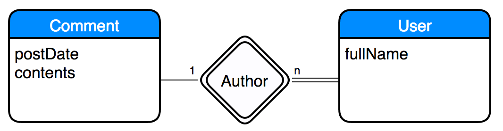
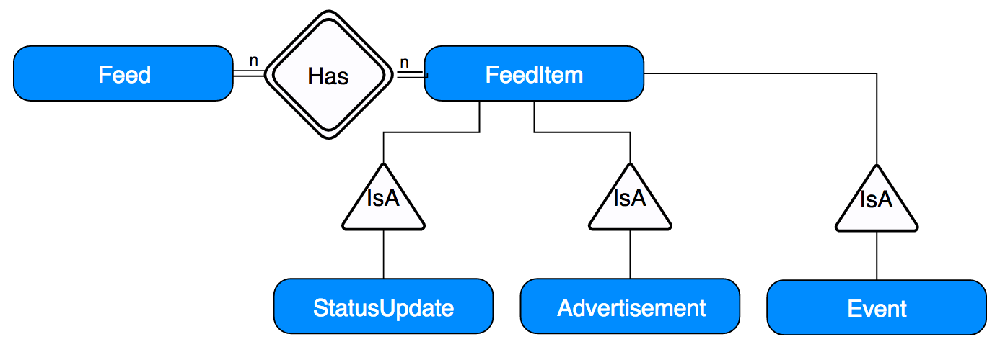
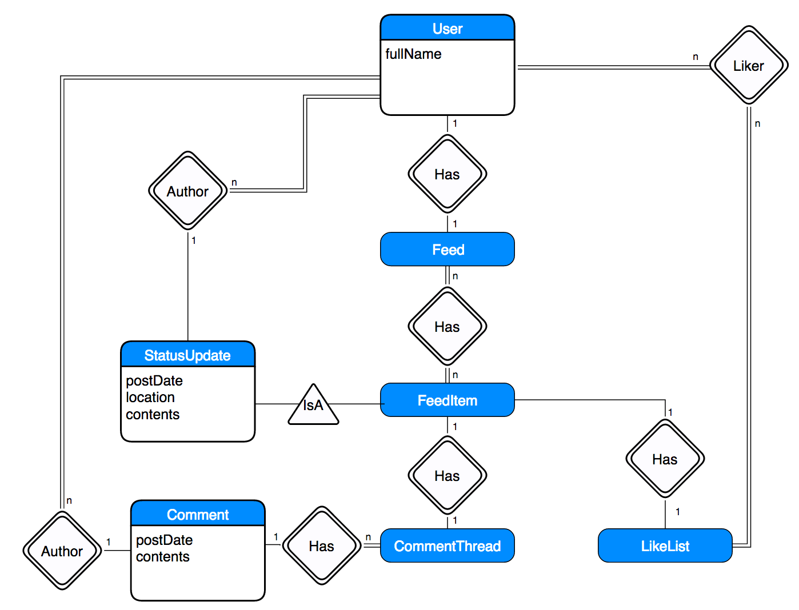
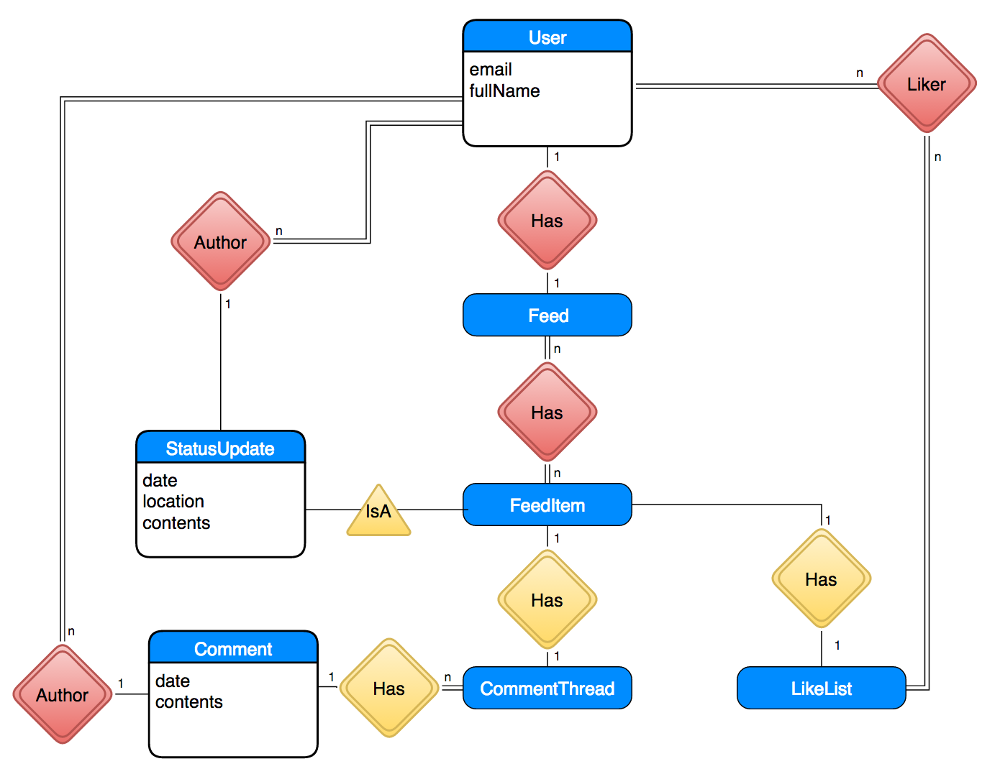

# JavaScript, React, and Mocking a Server

# Introduction

In the previous workshop, you created a static HTML mockup of
Facebook's desktop layout. In this workshop, we will take the *first
step* toward making the mockup dynamic and interactive using
JavaScript and
the [React library](https://facebook.github.io/react/index.html). In
the next workshop, we will complete the transition by adding actual
interaction on top of what we build in this workshop.

Our dynamic mockup will not contain a login page. Instead, it will
assume that a single user is already logged in, and will only cover a
small fraction of Facebook's functionality -- namely, posting status
updates, comments, and using the iconic "Like" button. In a much later
workshop, we'll cover adding login support to your Facebook clone.

We are also going to make the following simplifying assumptions to
make this workshop and the next go a bit faster:

* **Comments cannot have comments.** We'll leave the "Reply" button on
  comments nonfunctional.
* **Comments cannot have Likes.** We'll leave the "Like" button on
  comments nonfunctional.... until you add it in yourself in the next
  workshop.  Up until that point, we'll completely ignore that button.
* **Links to other parts of the site are nonfunctional.** By the end
  of this workshop and the next, you'll know enough to add those in if
  you ever feel like it.

To make the mockup work, we'll use a
simple
[stub/mock](http://stackoverflow.com/questions/2665812/what-is-mocking) database
and a mock server.

With that said, let's dive in!

# Step 00: Install Helpful Programs & Acquire Your Repository

Web development can be stressful. Here are some programs and plugins
that will make your life easier and prevent some of that stress.

## Helpful Atom Packages

The Atom Editor contains many plugins that will help you during this
assignment.

You can install the three we recommend with a single terminal command:

```
$ apm install react linter-eslint linter-htmlhint
```

*Note: `apm` is
the [Atom Package Manager](https://atom.io/packages). If you have Atom
open right now, you will need to close and re-open it before these
plugins take affect*

*Note 2: You can also search for and install packages from within Atom
in the Packages section of Preferences.*

Here's what each plugin does:

* **`react`**: Provides syntax highlighting support for the React
  language,
  [among other neat features.](https://orktes.github.io/atom-react/)
* **`linter-eslint`**: A *linter* for JavaScript and
  React. ([For fun historical reasons, JavaScript is formally known as *ECMAScript*](https://en.wikipedia.org/wiki/ECMAScript) --
  hence the ES.) Linters look for common problematic coding patterns
  or errors, and point them out to you. This plugin will save you a
  lot of time debugging.
* **`linter-htmlhint`**: We covered this at the end of
  Workshop 3. It's a linter for HTML. It does for HTML what ESLint
  does for JavaScript.

## React Dev Tools for your Browser

React provides
an
[extension for many web browsers that adds extra debug support for React applications](https://github.com/facebook/react-devtools). We
recommend adding it to Google Chrome, as it nicely complements that
browser's existing development tools.

## Acquire Your Repo

Fork
the
[repository for this workshop](https://github.com/umass-cs-326/Workshop4and5). You
will notice that this repository is called `Workshop4and5`. You will
be using the same repository for both workshop 4 and 5.

You'll notice that the repository is *eerily similar* to the
repository you're using for your team project. In fact... it's
basically the same repository. :)

Here's an explanation for each file in the repo:

* `.gitignore`: Entries in this file
  are [ignored by Git](https://git-scm.com/docs/gitignore).  We've
  added entries for automatically generated folders/files that you do
  not want to add to your repository, such as `node_modules` and
  `build/js/app.js`.
* `.eslintrc`: A configuration file for ESLint, which tells the linter
  which problematic behavior to warn about. The `linter-eslint`
  package will read this file automatically.
  * [You can add extra rules to this file if you want to](http://eslint.org/docs/user-guide/configuring.html),
    but most of you will want to keep the defaults.
  * [Here are some extra React rules you can choose to enable, too](https://github.com/yannickcr/eslint-plugin-react).
* `webpack.config.js`: This is
  a
  [webpack configuration script](https://webpack.github.io/docs/configuration.html),
  which tells `npm run serve` (and `npm run build`) how to build your
  project and serve it up over HTTP. You should not need to touch this
  script.
* `app/`: This is where you will put the JavaScript/React code for
  your application.
* `app/app.js`: The **entrypoint** to your application.
  * Webpack will pack up all of the JavaScript modules referenced from
    this file into `build/js/app.js` when you are running `npm run
    serve`. It'll print out the list of files into the terminal
    running the webserver.
* `app/database.js`: A simple mock database that we'll use during this
  workshop.
* `app/server.js`: You will define a simple mock server in this file
  during this workshop.
* `build/`: This is where you put the HTML, CSS,
  images,
  [web fonts](https://en.wikipedia.org/wiki/Web_typography#Web_fonts),
  and other assets. There's an `index.html` in there currently with
  the Facebook clone we built in Workshop 3.
* `package.json`: Contains a list of NPM dependencies that you
  installed with `npm install`, and the logic behind the `npm run
  serve` command. Do not mess with this file. The graders depend on
  the `npm run serve` command working properly.

You probably know the drill by now. `git clone` the repository, `cd`
into the directory, and run `npm install` to pull in its dependencies.

Once that's complete, you can run `npm run serve`, which does two
things:

* Starts a webserver at http://localhost:8080/
* Starts up [Webpack](https://webpack.github.io/), which will
  automatically rebuild `build/js/app.js` when your `app` folder
  changes
  * ... except that it doesn't write the result to your disk! Instead,
    it serves it up at `http://localhost:8080/js/app.js`
  * `npm run build` will run Webpack without the webserver, and will
    write the file to disk

# Step 01: "Ugh, World" widget

If you haven't already, run `npm run serve` in the workshop's
repository directory, and keep it running for the entire
workshop. Open a web browser to http://localhost:8080/. You should be
confronted with the Facebook mockup from the last workshop.

Before we implement Facebook's feed, let's use React to implement a
simple "ugh, world" *React component*, which simply prints the text
"ugh, world".  React components can be thought of as templates for
widgets on the webpage; they contain an HTML skeleton with holes that
you can fill in with specific data.

Let's write a simple "Ugh World" component that has no holes -- it
just prints "ugh, world". Add the following code to `app/app.js`:

```javascript
import React from 'react';
import ReactDOM from 'react-dom';

class UghWorld extends React.Component {
  render() {
    return (
      <p>ugh, world</p>
    );
  }
}

ReactDOM.render(
  <UghWorld />,
  document.getElementById('fb-feed')
);
```

*Note: If you have dabbled in React before this workshop, you may have
used something like `React.createClass(...)` to define Components. The
above code is equivalent, and
cleaner. :)
[Here's an overview on how to translate old `React.createClass(...)` code into new ES6 code](https://facebook.github.io/react/docs/reusable-components.html#es6-classes).*

If you refresh `http://localhost:8080/`, you'll notice that the
Facebook Feed is replaced with a despondent "ugh, world". Perfect!

If you have used JavaScript before, the above JavaScript may look
alien to you.  We're using
shiny [new ECMAScript 6 features](http://es6-features.org/#Constants),
which make code more readable, modular, and understandable. The
Webpack script you are running compiles these features down to
older-style JavaScript that runs across most web browsers, so you
benefit from readable code without sacrificing browser compatibility.

Let's break down the above code, line-by-line:

* On line 1, we `import React from 'react';`.
  * `react` is an [NPM module](https://www.npmjs.com/package/react)
    that you installed to `node_modules/react/` when you ran `npm
    install`.
  * This statement *imports* the library into your application so you
    can use it.
  * The library is available for use as the variable `React`.
  * This is the library we use to define React components.
  * JavaScript veterans: Here's an overview
    of
    [the new `import` and `export` functionality](http://es6-features.org/#ValueExportImport).
* On line 2, we do the same thing for `ReactDOM`.
  * This library is used to *render* React components to the DOM.
  * This is a separate library from `react` because React isn't just
    for web applications -- they have libraries to render React
    components as a part of desktop applications, too
    ([ReactNative](https://facebook.github.io/react-native/))
* On line 4, we define the `UghWorld` component as a *class* that
  extends `React.Component`.
  * Like in Java, we are declaring `UghWorld` as a subclass
    of
    [`React.Component`](https://facebook.github.io/react/docs/component-api.html) --
    so it inherits a number of methods from the component class.
  * JavaScript veterans: Here's an overview on [ECMAScript classes and inheritance](http://es6-features.org/#ClassDefinition).
* On line 5, we define the `render` function, which all React
  components require. This function returns the HTML for this
  component.
  * Normally, you cannot include HTML in JavaScript. We're actually
    using
    an
    [extension to JavaScript called JSX](https://facebook.github.io/react/docs/jsx-in-depth.html),
    which was developed specifically for React.
  * Unlike Java, there's no type signatures indicating the types of
    return values or arguments to the `render` function. JavaScript
    doesn't have *static types* -- meaning, you don't specify the type
    of things at all when you are programming.
* Finally, on line 12, we tell `ReactDOM` to render a `UghWorld`
  component into the `fb-feed` element on the webpage.
  * ReactDOM will replace the contents of the feed with the element
    returned from `UghWorld`'s `render()` function.
  * Notice how we refer to `UghWorld` using HTML notation. React
    *virtualizes* the DOM so that you can construct React components
    in the same way that you construct HTML elements. You *cannot*,
    however, refer to React components in an actual HTML file -- you
    can only refer to them within JavaScript files.

In `build/index.html`, we use a `script` tag to include the file
`build/js/app.js`, which Webpack generates every time you change the
source code in `app/`.

Make sense? If not, maybe things will get clearer as we use React a
bit more.

**`commit` your changes with the commit message `fb1`, and `push` your commit to GitHub.**

# Step 02: Facebook Feed as a Static React Component

Since we want to make the Facebook feed dynamic, our first step is to
turn the Facebook feed into a React Component.  Our first aim is
nothing fancy: We want to create a React component that always returns
the same HTML that our mockup currently has.

*Delete* your `UghWorld` component in `app.js`, as we no longer need
it, and create a new `Feed` component in the same manner.  *Cut* the
HTML for the feed from `index.html` (leaving behind an empty `fb-feed`
div), and *paste* it into the `render` method of the `Feed` component.

`app.js` should now look like the following:

```javascript
import React from 'react';
import ReactDOM from 'react-dom';

class Feed extends React.Component {
  render() {
    return (
      <!-- Status update entry -->
      <div class="fb-status-update-entry panel panel-default">
      <!-- (The rest removed for brevity) -->
    );
  }
}

ReactDOM.render(
  <Feed />,
  document.getElementById('fb-feed')
);
```

If you installed the recommended Atom packages, you'll quickly notice an
error at the bottom of your editor coming from the `eslint` package:


*Adjacent JSX elements must be wrapped in an enclosing tag.* In other words,
`render()` needs to return *one* HTML element, but we're returning
multiple in sequence.

To fix this, enclose the entire return value of `render()` in a single `<div>`.
This will not change what the feed actually looks like, since we are not applying
any special styling to this `div`.

Now, `eslint` will warn about another issue:


*Unexpected token !* JSX doesn't support HTML comment tags (`<!-- -->`). Strip all of them out.

`eslint` is still complaining, though:


In normal HTML, we can have elements like `<hr>` and `<br>`, which do not have
closing tags. With React/JSX, however, we have to explicitly close *every* tag.

Change instances of `<hr>` to `<hr />`, `<br>` to `<br />`, and `<input ... >` to `<input ... />`.

We're almost done, but `eslint` is complaining *again*. This time, it's spitting
out an error on nearly every line of the file:


This time, `eslint` objects to us using the `class` property on HTML elements,
and urges us to use the `className` property itself. This seems erroneous,
but it is actually an example of a [leaky abstraction](https://en.wikipedia.org/wiki/Leaky_abstraction) --
this unfortunate restriction is the direct result of how React is implemented.

We mentioned previously that we are using React's extension to JavaScript called
JSX, which lets us include HTML snippets in JavaScript. JSX actually *compiles*
these HTML snippets into JavaScript. JavaScript has a long list of [reserved keywords](https://developer.mozilla.org/en-US/docs/Web/JavaScript/Reference/Lexical_grammar#Keywords),
which you cannot use as identifiers in your program. `class` is among these reserved keywords.
As a result, you can not use any of those reserved identifiers as property names
in your React HTML snippets.

Since you *need* to use the `class` property to apply CSS styles to HTML elements,
React lets you set this property via the special `className` property. When
ReactDOM renders your components, it'll apply the value of `className` to the
`class` property of the HTML element.

To fix this issue, replace every instance of `class=` with `className=`. You can
do this automatically using the "Replace All" feature of Atom; click on "Find" in
the Atom menubar, click on "Find in buffer...", and fill out the fields at the
bottom of the editor screen:


Once you click "Replace All", all of the warnings should go away! And when you
go to `http://localhost:8080/`, you should see the Facebook feed, as it looked
like in the static mockup.

**`commit` your changes with the message `fb2` and `push` the commit to GitHub.**

# Step 03: Breaking the Feed Apart Into Subcomponents

Right now, we have a JavaScript file with a single React component, called `Feed`, that produces
a giant blob of HTML. We should break this component into subcomponents.

Let's take a step back and think for a moment. What subcomponents should we make?
Think about it for a moment.... and then read on.

A Facebook feed has a status update entry field, and a sequence of feed items. Each feed item has 1) some type of
content, which may be a status update, advertisement, event, or something else;
and 2) a comment thread. A comment thread contains a sequence of comments, followed
by a comment entry box.

From this thought process, we should define the following React components to
render the basic feed:

* `Feed`
* `StatusUpdateEntry`
* `FeedItem`
* `StatusUpdate`
* `CommentThread`
* `Comment`
* `CommentEntry`

We could define all of these components in a single file, but that becomes
hard to maintain. Instead, create the folder `app/components/`, and put seven new
JavaScript files into that folder -- one for each component (`app/feed.js`, `app/feeditem.js`, `app/statusupdate.js`...).
Keep the files empty for now. We're going to define each together, one by one.

## `app/components/comment.js`

To make this workshop simple, we're going to define these components from
the bottom up -- starting with the smallest, most isolated component: Comments.

Open up `app/components/comment.js` in Atom, and paste in the following code:

```javascript
import React from 'react';

export default class Comment extends React.Component {
  render() {
    return (
      <div>
        <div className="media-left media-top">
          PIC
        </div>
        <div className="media-body">
          <a href="#">Someone Else</a> hope everything is ok!
          <br /><a href="#">Like</a> · <a href="#">Reply</a> · 20 hrs
        </div>
      </div>
    )
  }
}
```

Notice how we have to `import React` again. Like with Java classes, every
JavaScript module has to import the things that it needs.

You may also notice the `export default` just before the `class` declaration on
line 3. This statement says: "When some other module imports the `comment` module, this is what is imported by default."
This will make more sense when we write a module that references the `comment`
module.

In any case, this React component renders a single mockup comment in its
current form. Let's change it to be more like a template, where we can use it
to render any comment.

On normal HTML elements, you can define attributes, like `class` and `id`, and
assign values to those elements. Similarly, React components support attributes,
but calls them *props* (properties).

In addition, normal HTML elements can have *children*. In the following example, a `div`
has two children: a `span` and a `p`:

```html
<div><span></span><p></p></div>
```

React components support children, too. They can be accessed through the special
`children` prop.

Our comment needs the following properties:

* `author`: The author of the comment.
* `postDate`: The date and time that the post was created.
* The actual text of the comment -- which can be specified as a *child* of the comment.

You can access named props through the `props` property on the component, and use
them in the template. Like in Java and other languages, the `this` variable
refers to the current object.

Re-define the `render()` method so it is more like a template:

```javascript
export default class Comment extends React.Component {
  render() {
    return (
      <div>
        <div className="media-left media-top">
          PIC
        </div>
        <div className="media-body">
          <a href="#">{this.props.author}</a> {this.props.children}
          <br /><a href="#">Like</a> · <a href="#">Reply</a> ·
            {this.props.postDate}
        </div>
      </div>
    )
  }
}
```

When you're writing HTML in React, you can insert JavaScript statements
between curly braces. When `render()` is run, React runs those JavaScript
statements, and uses their values in the resulting HTML.

Simply referring to `{this.props.children}` will insert all of the children of
the `Comment` in place.

Later on, when we describe how to create a status update in React, we can use the
following HTML in React to re-create the comment that we just replaced with a template:

```html
<Comment author="Someone Else" postDate="20 hrs">
  hope everything is ok!</Comment>
```

Note that `props` are **read only**. A component should *never* modify its own `props`. They
should only be set using the HTML syntax.

## `app/components/commententry.js`

Since we're not yet adding interactivity to our mockup, the comment entry is nothing special.
Re-use the static HTML from the mockup. We'll revisit this component later to
handle text entry.

```javascript
import React from 'react';

export default class CommentEntry extends React.Component {
  render() {
    return (
      <div>
        <div className="media-left media-top">
          PIC
        </div>
        <div className="media-body">
          <div className="input-group">
            <input type="text" className="form-control"
                   placeholder="Write a comment..." />
            <span className="input-group-btn">
              <button className="btn btn-default" type="button">
                <span className="glyphicon glyphicon-camera"></span>
              </button>
              <button className="btn btn-default" type="button">
                <span className="glyphicon glyphicon-heart">
                </span>
              </button>
            </span>
          </div>
        </div>
      </div>
    )
  }
}
```

## `app/components/commentthread.js`

Next, let's define the `CommentThread` component. A `CommentThread` displays a
list of `Comment`s. It is most natural to define `CommentThread` such that
you can nest `Comments` as children, e.g.:

```html
<CommentThread>
  <Comment author="Someone Else" postDate="20 hrs">
    hope everything is ok!</Comment>
  ...
</CommentThread>
```

So far, we know how to insert all of the children into a template all at once --
simply insert `{this.props.children}`. A `CommentThread` needs to enclose each
child comment into a list item (`li`) tag, so we need to *iterate* over the
comment thread's children and translate them into list items.

React has a special function for doing just that for the `children` property:
[`React.Children.map`](https://facebook.github.io/react/docs/top-level-api.html#react.children).
A [map function](https://en.wikipedia.org/wiki/Map_(higher-order_function) performs an
operation on every element of an array, and assembles the result into a new array.
For example, given the array `[0,1,2,3]` and the function `f(x) { return x + 1 ; }`,
applying the `map` function to the array and `f` would yield the array `[1,2,3,4]`.

*Note: JavaScript has `map` defined for regular JavaScript arrays, but the `children` property is a bit special. You should always use `React.Children.map` to iterate over a React component's children.*

*Note 2: It's special because [`children` is either an only child or an array of children](https://facebook.github.io/react/tips/children-props-type.html), so simply calling `this.props.children.map` will not work if there are multiple children. React does this for performance -- it avoids creating an array in the only child case.*

With this in mind, we can define the `CommentThread` in the following manner:

```javascript
import React from 'react';

export default class CommentThread extends React.Component {
  render() {
    return (
      <ul className="media-list">
        {React.Children.map(this.props.children, function(child) {
          return (
            <li className="media">
              {child}
            </li>
          )
        })}
      </ul>
    )
  }
}
```

Here, the `map` function takes a `child`, and returns the `child` wrapped in a
list item (`li`).

We're almost done! The `CommentThread` ends in a `CommentEntry` component, which
lets the user enter a comment. Since `CommentEntry` is defined in a separate
JavaScript module, we need to import it.

You may be tempted to write `import CommentEntry from 'commententry';`, but **that would be incorrect**.
You *actually* need to write `import CommentEntry from './commententry';`. The `./` is key:
the module system needs to know the path to `commententry.js`, relative to `commentthread.js`.
Modules without prefixes, like `react` or `react-dom`, are found in the `node_modules` folder.
This is a confusing subtlety, but that's software!

*Note: While Windows normally uses the '\' character as a path separator, you must always use Unix-style path separators ('/') when specifying paths to modules -- even when programming on Windows.*

Our final `CommentThread` looks like this:

```javascript
import React from 'react';
import CommentEntry from './commententry';

export default class CommentThread extends React.Component {
  render() {
    return (
      <ul className="media-list">
        {React.Children.map(this.props.children, function(child) {
          return (
            <li className="media">
              {child}
            </li>
          )
        })}
        <li className="media">
          <CommentEntry />
        </li>
      </ul>
    )
  }
}
```

Since `CommentThread` constructs a `CommentEntry` in its `render` function, it is
said to be the **owner** of `CommentEntry`.

## `app/components/statusupdate.js`

By now, you may be getting the hang of React. Let's create a basic
`StatusUpdate` component, using the contents of our static mockup. It consists
of two Bootstrap `row`s, so we will need to unify them under a single `<div>`:

```javascript
import React from 'react';

export default class StatusUpdate extends React.Component {
  render() {
    return (
      <div>
        <div className="row">
          <div className="col-md-10">
            <div className="media">
              <div className="media-left media-top">
                PIC
              </div>
              <div className="media-body">
                <a href="#">Someone</a>
                <br /> Yesterday at 3:48pm · Austin, TX · <span
                  className="glyphicon glyphicon-user"></span>
              </div>
            </div>
          </div>
          <div className="col-md-2">
            <span className="caret pull-right"></span>
          </div>
        </div>
        <div className="row">
          <div className="col-md-12">
            ugh.
          </div>
        </div>
      </div>
    )
  }
}
```

What information goes into a Status Update? The above status update has the following
information:

* `author`: Someone
* `postDate`: Yesterday at 3:48PM
* `location`: Austin, TX
* Contents: ugh.

These translate into the React Component properties we need. The contents can be specified
as a child of the status update. Let's rejigger the component as a template:

```javascript
import React from 'react';

export default class StatusUpdate extends React.Component {
  render() {
    return (
      <div>
        <div className="row">
          <div className="col-md-10">
            <div className="media">
              <div className="media-left media-top">
                PIC
              </div>
              <div className="media-body">
                <a href="#">{this.props.author}</a>
                <br /> {this.props.postDate} · {this.props.location} · <span
                  className="glyphicon glyphicon-user"></span>
              </div>
            </div>
          </div>
          <div className="col-md-2">
            <span className="caret pull-right"></span>
          </div>
        </div>
        <div className="row">
          <div className="col-md-12">
            {this.props.children}
          </div>
        </div>
      </div>
    )
  }
}
```

## `app/components/feeditem.js`

As mentioned before, a `FeedItem` contains some type of content, such as a
`StatusUpdate`, and a `CommentThread`. Let's re-create the status update from our
mockup using these components.

```javascript
import React from 'react';
import StatusUpdate from './statusupdate';
import CommentThread from './commentthread';
import Comment from './comment';

export default class FeedItem extends React.Component {
  render() {
    return (
      <div className="fb-status-update panel panel-default">
        <div className="panel-body">
          <StatusUpdate author="Someone" postDate="Yesterday at 3:48pm"
                        location="Austin, TX">
            ugh.
          </StatusUpdate>
          <hr />
          <div className="row">
            <div className="col-md-12">
              <ul className="list-inline">
                <li>
                <a href="#">
                  <span className="glyphicon glyphicon-thumbs-up">
                  </span> Like</a>
                </li>
                <li>
                <a href="#">
                  <span className="glyphicon glyphicon-comment">
                  </span> Comment</a>
                </li>
                <li>
                <a href="#">
                  <span className="glyphicon glyphicon-share-alt">
                  </span> Share</a>
                </li>
              </ul>
            </div>
          </div>
        </div>
        <div className="panel-footer">
          <div className="row">
            <div className="col-md-12">
              <a href="#">13 people</a> like this
            </div>
          </div>
          <hr />
          <CommentThread>
            <Comment author="Someone Else" postDate="20 hrs">
              hope everything is ok!</Comment>
            <Comment author="Another Person" postDate="20 hrs">
              sending hugs your way</Comment>
          </CommentThread>
        </div>
      </div>
    )
  }
}
```

An astute student may wonder why we are hardcoding everything into `FeedItem`,
rather than make them properties of `FeedItem`. The reason will become apparent
once we move onto the next big step, where we read data from a mock server!
We'll return to that concern at that time.

## `app/components/statusupdateentry.js`

Here's the non-interactive `StatusUpdateEntry` widget, which is a boring
static React component:

```javascript
import React from 'react';

export default class StatusUpdateEntry extends React.Component {
  render() {
    return (
      <div className="fb-status-update-entry panel panel-default">
        <div className="panel-body">
          <ul className="nav nav-pills">
            <li role="presentation" className="active">
              <a href="#"><span className="glyphicon glyphicon-pencil">
                </span> <strong>Update Status</strong></a>
            </li>
            <li role="presentation">
              <a href="#"><span className="glyphicon glyphicon-picture">
                </span> <strong>Add Photos/Video</strong></a>
            </li>
            <li role="presentation">
              <a href="#"><span className="glyphicon glyphicon-th">
                </span> <strong>Create Photo Album</strong></a>
            </li>
          </ul>
          <div className="media">
            <div className="media-left media-top">
              PIC
            </div>
            <div className="media-body">
              <div className="form-group">
                <textarea className="form-control" rows="2"
                          placeholder="What's on your mind?">
                </textarea>
              </div>
            </div>
          </div>
          <div className="row">
            <div className="col-md-6">
              <div className="btn-group" role="group">
                <button type="button" className="btn btn-default">
                  <span className="glyphicon glyphicon-camera"></span>
                </button>
                <button type="button" className="btn btn-default">
                  <span className="glyphicon glyphicon-user"></span>
                </button>
                <button type="button" className="btn btn-default">
                  <span className="glyphicon glyphicon-heart">
                  </span>
                </button>
                <button type="button" className="btn btn-default">
                  <span className="glyphicon glyphicon-pushpin"></span>
                </button>
              </div>
            </div>
            <div className="col-md-6">
              <div className="pull-right">
                <button type="button" className="btn btn-default">
                  <span className="glyphicon glyphicon-user"></span>
                    Friends <span className="caret"></span>
                </button>
                <button type="button" className="btn btn-default">
                  Post
                </button>
              </div>
            </div>
          </div>
        </div>
      </div>
    )
  }
}
```

## `app/components/feed.js`

Since most of the data is in `StatusUpdate`, the `Feed` component is now quite
boring. It holds a `StatusUpdateEntry` and a `FeedItem`:

```javascript
import React from 'react';
import FeedItem from './feeditem';
import StatusUpdateEntry from './statusupdateentry';

export default class Feed extends React.Component {
  render() {
    return (
      <div>
        <StatusUpdateEntry />
        <FeedItem />
      </div>
    )
  }
}
```

## `app/app.js`

Back in the main entrypoint of your application, we simply render a `Feed`
into the `fb-feed` element on the webpage:

```javascript
import React from 'react';
import ReactDOM from 'react-dom';
import Feed from './components/feed';

ReactDOM.render(
  <Feed />,
  document.getElementById('fb-feed')
);
```

On line 3, notice that we specify a relative path to `feed`. `app.js` is in the `app` folder,
and `feed` is in the `app/components` folder, therefore we use the path `./components/feed`.

## Examine the page

Now, open your web browser to `http://localhost:8080/`. If you already have your web browser open to that page, make sure you hit "Refresh" to pull in the new code you just wrote. You'll notice that the static mockup looks the same as ever.

If you installed the [React Dev Tools](https://github.com/facebook/react-devtools)
and open the Chrome Development Tools to the "React" tab, you'll see all of the
components you've defined!


**`add` all of the files in `components`, `commit` with message `fb3`, `push` to GitHub**

# Step 04: Moving Data into a Mock Database & Server

Let's back away from React for a moment to think about the *data* that's behind the stuff in our Facebook clone.
A real web application gets data from a server. While we will not be adding an
*actual* server to our Facebook clone in this workshop, we need to structure our
dynamic mockup properly so we can add one later! Figuring this out *now* will
make the transition to a real server much simpler.

Your eventual server will send data to your application as [JSON objects](https://en.wikipedia.org/wiki/JSON#Example).
JSON objects are either bags of properties with values, or arrays of values.
Note that all JSON objects are JavaScript objects, but not all JavaScript
objects are JSON objects.

We have already thought through the data that most of our React components will
display through all of the `props` we've defined.
Consider the `Comment` component. You could imagine representing one of our example comments using the following JSON object:

```json
{
  "author": "Someone Else",
  "contents": "hope everything is ok!",
  "postDate": "20 hrs"
}
```

However, there are a few issues with this JSON object:

* **The postDate doesn't accurately describe the time of this post.** It says "20 hrs", which is what Facebook displays when something was posted 20 hours ago.
  * There's a simple fix for this: We can change it to use [Unix time](https://en.wikipedia.org/wiki/Unix_time), which is the number of
    milliseconds since January 1st, 1970. Most computer systems use Unix time (or a variant that fixes the [leap second issue](https://en.wikipedia.org/wiki/Unix_time#Leap_seconds) -- aren't computers fun?) to represent dates and time.
  * In JavaScript, you can translate Unix time into date strings (e.g. 01/01/1970 1:00PM). We'll briefly cover this later.
* **The author may have authored multiple comments.** If the author changes their name, then we would have to update all of their comment objects.
* **There may be more than one author with that name.** If the author changes their name, we could not unambiguously determine which comments they posted.

How can we solve these fundamental issues?

## Entity-Relationship (ER) Diagrams

There's a nice type of diagram from the database community that helps us think about
data: an [Entity-Relationship Diagram](https://en.wikipedia.org/wiki/Entity%E2%80%93relationship_model),
or ER diagram for short. You may have seen these before if you have taken a
database course.
We aren't going to go over all of the features of these diagrams, but we'll
go over the only two relationships you'll need to know to model data.

The fundamental concepts behind an *entity-relationship* diagram are simple: you have *entities*,
and those *entities* are *related* to one another in some way. Unlike relationships
on Facebook, these relationships are rarely "complicated". Let's go over a
simple example.

In our Facebook clone, a *Comment* is an entity. A *Comment* is related to a *User* in that:

* A comment is *authored* by one user.
* A user can *author* zero or more comments.

In an ER diagram, we represent that relationship like this:



*Note: In an ER diagram, you use `n` to denote an arbitrary number.*

*Note 2: If you've written ER diagrams before, the above notation may be unfamiliar to you. There are many different ER diagram notations. We chose the notation that is easiest to read without any prior experience with ER diagrams.*

These are informally called *Has* relationships: An author *has* multiple comments,
and a comment *has* an author. Entities can also have basic properties, like *postDate*,
that don't have a relationship with other entities and do not have to be represented as a
separate entity.

In addition, in our Facebook clone, a *Feed* contains multiple *FeedItem*, but
on Facebook, a *FeedItem* could be a *StatusUpdate*, *Advertisement*, *Event*,
and more.
We can represent this relationship as a *IsA* relationship:



We won't be adding support for non-*StatusUpdate* *FeedItem* types in this workshop,
but we'll design the *FeedItem* so that more types of items can be added in the future.

As a small subtlety, notice that a *FeedItem* can have multiple *Feeds*. Each
user of Facebook has a separate Feed, but multiple users can see the same *FeedItem*.

With *Has* and *IsA* relationships, we can create an ER diagram for all of the data in our Facebook clone:



Take a moment to think about the diagram. Do all of the relationships make sense
to you?

Also, notice the following three things:

* **Not every React component is an entity.** An ER diagram is about *data*, while React components are about the *UI*.
  It wouldn't make sense to have the *CommentEntry* component be an entity, since comment entries aren't a piece of data.
* **Not every entity is a React component.** *User* and *LikeList* aren't specific UI components, but they are important
  pieces of data referenced by particular UI components.

We haven't discussed *LikeList* yet. A *LikeList* is a list of users that "liked" something.
On Facebook, you can actually click on an item's "Like" count to receive a list of users that liked that content.
A *LikeList* contains multiple users, and a user can be in multiple *LikeList*.

## How To Translate ER Diagrams Into JSON Objects

If we combine the ER diagram with knowledge of what our UI needs to display,
we can figure out how to structure our JSON objects. JSON objects can refer
to each other in one of two ways, which we'll illustrate with a Status Update
and its Author:

**Embedding:** You can embed a JSON object into another JSON object.

```json
{
  "postDate": 1454188576288,
  "location": "Amherst, MA",
  "contents": "The COMPSCI326 students are really good this semester!",
  "author": {
    "fullName": "John Vilk"
  }
}
```

**Referencing:** You can assign a unique ID to a JSON object, and refer to the JSON object
by that ID.

```json
{
  "_id": 3,
  "fullName": "John Vilk"
}

{
  "postDate": 1454188576288,
  "location": "Amherst, MA",
  "contents": "The COMPSCI326 students are really good this semester!",
  "author": 3
}
```
/_

It makes sense to embed an object `A` into object `B` when you know that:

* **`A` is only referenced from `B`.** For example, a *Comment* belongs to a single *CommentThread*.
* **Your UI would never request `A` without `B`.** For example, the UI would only
  request a *Comment* when displaying its *CommentThread*.
  * On real Facebook, Facebook will only show a select 10 or so comments. Facebook
    likely uses a hybrid approach, where it embeds the comments that will display
    immediately but references those that the user has to click to view.
* **If `A` could be potentially large, your UI never requests `B` without needing `A`.**
  For example, a user's Feed is potentially infinite. From the first two guidelines, it would make sense to embed a Feed into a User: Users only have one Feed, Feeds only have one User, and Facebook would only request a Feed for the current User.
  However, Facebook requests User information for each Comment in a CommentThread,
  and for each StatusUpdate. It would be wasteful to embed each User's Feed every time
  a User is requested.
* **`A` and `B` have an `IsA` relationship.** For example, an individual `StatusUpdate` is particular type of `FeedItem`.
  A `FeedItem` needs the `StatusUpdate` data to display properly. (Or, if it's an `Advertisement`, it would need the `Advertisement` data.)

Otherwise, a reference is appropriate. For a Status Update and its Author,
a reference is most appropriate. For a User and its Feed, a reference is most
appropriate. For a CommentThread and its Comments, an embedding is most appropriate.

With that lesson out of the way, let's work on structuring Facebook's data!

## Translating Mock Data into a JSON Object Database

Let's apply our rules to our ER diagram. **Red** relationships illustrate *references*, and
**yellow** relationships illustrate *embeddings*:



With that diagram in mind, we can create JSON object collections for each
grouping of entities. We will need collections of *users*, *feeds*, and *feedItems*.
The database that we will use later on in the course structures objects in this manner.

Open up `app/database.js`. You'll notice that a `initialData` variable is defined as an
empty JSON object.
Change the definition of the `data` variable to reference mock data:

```javascript
var initialData = {
  // The "user" collection. Contains all of the users in our Facebook system.
  "users": {
    // This user has id "1".
    "1": {
      "_id": 1,
      "fullName": "Someone",
      "feed": 1
    },
    "2": {
      "_id": 2,
      "fullName": "Someone Else",
      "feed": 2
    },
    "3": {
      "_id": 3,
      "fullName": "Another Person",
      "feed": 3
    },
    // This is "you"!
    "4": {
      "_id": 4,
      "fullName": "John Vilk",
      // ID of your feed.
      "feed": 4
    }
  },
  // The 'feedItems' collection. Contains all of the feed items on our Facebook
  // system.
  "feedItems": {
    "1": {
      "_id": 1,
      // A list of users that liked the post. Here, "Someone Else" and "Another Person"
      // liked this particular post.
      "likeCounter": [
        2, 3
      ],
      // The type and contents of this feed item. This item happens to be a status
      // update.
      "type": "statusUpdate",
      "contents": {
        // ID of the user that posted the status update.
        "author": 1,
        // 01/24/16 3:48PM EST, converted to Unix Time
        // (# of milliseconds since Jan 1 1970 UTC)
        // https://en.wikipedia.org/wiki/Unix_time
        "postDate": 1453668480000,
        "location": "Austin, TX",
        "contents": "ugh."
      },
      // List of comments on the post
      "comments": [
        {
          // The author of the comment.
          "author": 2,
          // The contents of the comment.
          "contents": "hope everything is ok!",
          // The date the comment was posted.
          // 01/24/16 22:00 EST
          "postDate": 1453690800000
        },
        {
          "author": 3,
          "contents": "sending hugs your way",
          "postDate": 1453690800000
        }
      ]
    }
  },
  // "feeds" collection. Feeds for each FB user.
  "feeds": {
    "4": {
      "_id": 4,
      // Listing of FeedItems in the feed.
      "contents": [1]
    },
    "3": {
      "_id": 3,
      "contents": []
    },
    "2": {
      "_id": 2,
      "contents": []
    },
    "1": {
      "_id": 1,
      "contents": []
    }
  }
};
```
\_

Notice how the structure of these JSON objects falls right out of the diagram
we constructed!

The rest of the `database` module contains methods that emulate a fairly simple MongoDB-like database (`readDocument`, `writeDocument`, `addNewDocument`).
(MongoDB calls its objects 'documents'.)
These functions read/write/add documents to particular collections.

This fake database will store data in [Web Storage](https://developer.mozilla.org/en-US/docs/Web/API/Web_Storage_API),
which stores data with your web browser. If you modify the database using these
methods, close your web browser, reopen your web browser, and return to your
mockup, it will retain your changes. We will use these functions to build
mock server functionality.

## Mocking the Server

Now that we have data in our "database", we can write functions that mock the
server. Open the file `app/server.js`; we'll write the functions in this file.
There will already be a `emulateServerReturn` function in this file.

First, we need a function that returns all of the data needed to render the Feed.
The Feed object in our database contains *references* to FeedItem objects.
We should resolve these references into objects in the mock server, and change them
into *embedded objects* before returning the data to the application. [You will
need to do the same thing in the *actual* server when we implement it in a future workshop.](https://docs.mongodb.org/manual/reference/database-references/#manual-references)
We should also resolve the authors of comments and posts.

Why do we even need a server? Why can't our Facebook client (where "client" is the JavaScript/HTML/CSS part of the web application) make database queries
directly? Here's why:

* **The database may have data that you do not want to send to the client.** Anything that you send from your server to the client can be seen by the user of that client. If we sent raw database User objects to our Facebook application, and those User objects contained email addresses and passwords, you'll have a serious data leak on your hands.
  * We're not going to cover censoring objects for the client in this workshop, but we will when we move to a real server.
* **A user can modify your client, and change its requests to delete data or request data it should not have access to.** Any user of
your client can open the Chrome Development Tools and start firing off queries to your server. If you talked to the database directly,
a user could download the entire database or delete its contents if it wanted to. The server is a safeguard -- it controls *who* has access to *what* data.
  * We are not going to cover access control in this workshop, but we will when we move to a real server.
* **A server improves the performance of your application over raw database access by reducing the number of requests.** Your client is running on a device somewhere on the Internet. Each server request and response needs to make it through the Internet, which can take
hundreds of milliseconds if we're talking a mobile internet connection. The server is on a high-speed connection to the database, and can resolve references in the database objects quickly. With a server, the client can request a user's Facebook Feed in a single Internet request, and receive a Feed object with all of its needed object references converted into embeddings.
* **The server can kick off other events in response to your server request.** If you post a comment to Facebook, Facebook's servers
will add a comment to that comment thread, add a notification to any users who have participated in that comment thread,
send a push notification to users with the Facebook app, and send emails to people who have Facebook notifications configured
for email.

With that in mind, we can write a mock server function that emulates a server request for the user's feed. To render the Feed, our React component needs:

* The contents of each FeedItem
* The author of each StatusUpdate
* The author of each Comment.
* The users that Liked the post.

With that in mind, let's add a `getFeedData` function to our mock server.

```javascript
/**
 * Given a feed item ID, returns a FeedItem object with references resolved.
 * Internal to the server, since it's synchronous.
 */
function getFeedItemSync(feedItemId) {
  var feedItem = readDocument('feedItems', feedItemId);
  // Resolve 'like' counter.
  feedItem.likeCounter =
    feedItem.likeCounter.map((id) => readDocument('users', id));
  // Assuming a StatusUpdate. If we had other types of
  // FeedItems in the DB, we would
  // need to check the type and have logic for each type.
  feedItem.contents.author =
    readDocument('users', feedItem.contents.author);
  // Resolve comment author.
  feedItem.comments.forEach((comment) => {
    comment.author = readDocument('users', comment.author);
  });
  return feedItem;
}

/**
 * Emulates a REST call to get the feed data for a particular user.
 * @param user The ID of the user whose feed we are requesting.
 * @param cb A Function object, which we will invoke when the Feed's data is available.
 */
export function getFeedData(user, cb) {
  // Get the User object with the id "user".
  var userData = readDocument('users', user);
  // Get the Feed object for the user.
  var feedData = readDocument('feeds', userData.feed);
  // Map the Feed's FeedItem references to actual FeedItem objects.
  // Note: While map takes a callback function as an argument, it is
  // synchronous, not asynchronous. It calls the callback immediately.
  feedData.contents = feedData.contents.map(getFeedItemSync);
  // Return FeedData with resolved references.
  // emulateServerReturn will emulate an asynchronous server operation, which
  // invokes (calls) the "cb" function some time in the future.
  emulateServerReturn(feedData, cb);
}
```

Notice that we used `export` instead of `export default`. A module that `imports`
the `server` module will need to explicitly import `getFeedData`, e.g.:

```javascript
import { getFeedData } from './server';
```

Had we also `export`ed a function called `createComment`, a module can import both
with:

```javascript
import { getFeedData, createComment } from './server';
```

As mentioned before, we are not going to add access control to our mock server,
as it does not make sense for a mockup. When we move this function to the actual
server and look at security, we will add checks that verify that:

* The user is logged in.
* The user is requesting their own Feed, and not someone else's.

**`commit` your changes with message `fb4` and `push` them to GitHub.**

# Conclusion

Now that we have a mock server, we can re-visit our components and change them to:

* Interact with the "server"
* Support user interaction (e.g. posting status updates)

We will tackle these two changes (and more!) in the next workshop!

# Submission

You must submit the URL of your **Workshop4and5** GitHub repository to
Moodle. Visit Moodle, find the associated Workshop 4 activity, and
provide your URL. Make sure your **Workshop4and5** repository is
public so we can clone your repository and evaluate your
work. **Submitting the URL for this assignment is part of completing
the work.**
