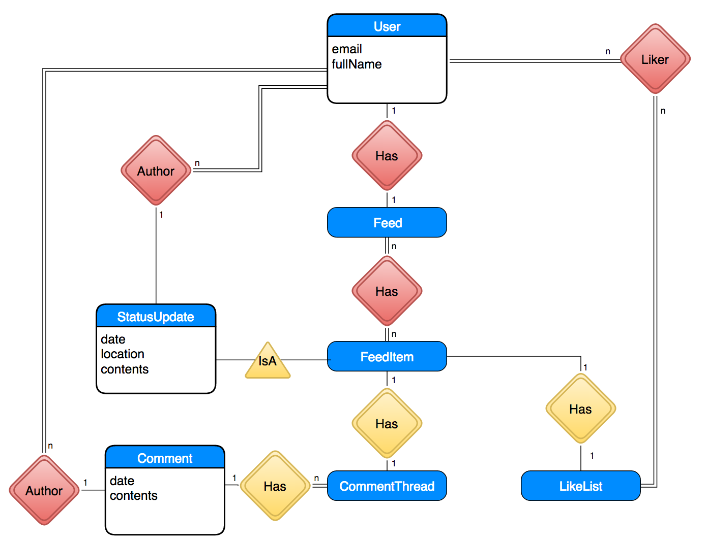

# Workshop 07: Data Modeling and Mock Databases

This workshop continues from
where [Workshop 06](../workshop-06/workshop-06.md) left off. You do
not need to clone a new repository you simply begin in the repository
you used for [Workshop 06](../workshop-06/workshop-06.md).

# Step 04: Moving Data into a Mock Database & Server

Let's back away from React for a moment to think about the *data* that's behind the stuff in our Facebook clone.
A real web application gets data from a server. While we will not be adding an
*actual* server to our Facebook clone in this workshop, we need to structure our
dynamic mockup properly so we can add one later! Figuring this out *now* will
make the transition to a real server much simpler.

Your eventual server will send data to your application as [JSON objects](https://en.wikipedia.org/wiki/JSON#Example).
JSON objects are either bags of properties with values, or arrays of values.
Note that all JSON objects are JavaScript objects, but not all JavaScript
objects are JSON objects.

We have already thought through the data that most of our React components will
display through all of the `props` we've defined.
Consider the `Comment` component. You could imagine representing one of our example comments using the following JSON object:

```json
{
  "author": "Someone Else",
  "contents": "hope everything is ok!",
  "postDate": "20 hrs"
}
```

However, there are a few issues with this JSON object:

* **The postDate doesn't accurately describe the time of this post.** It says "20 hrs", which is what Facebook displays when something was posted 20 hours ago.
  * There's a simple fix for this: We can change it to use [Unix time](https://en.wikipedia.org/wiki/Unix_time), which is the number of
    milliseconds since January 1st, 1970. Most computer systems use Unix time (or a variant that fixes the [leap second issue](https://en.wikipedia.org/wiki/Unix_time#Leap_seconds) -- aren't computers fun?) to represent dates and time.
  * In JavaScript, you can translate Unix time into date strings (e.g. 01/01/1970 1:00PM). We'll briefly cover this later.
* **The author may have authored multiple comments.** If the author changes their name, then we would have to update all of their comment objects.
* **There may be more than one author with that name.** If the author changes their name, we could not unambiguously determine which comments they posted.

How can we solve these fundamental issues?

## Entity-Relationship (ER) Diagrams

There's a nice type of diagram from the database community that helps us think about
data: an [Entity-Relationship Diagram](https://en.wikipedia.org/wiki/Entity%E2%80%93relationship_model),
or ER diagram for short. You may have seen these before if you have taken a
database course.
We aren't going to go over all of the features of these diagrams, but we'll
go over the only two relationships you'll need to know to model data.

The fundamental concepts behind an *entity-relationship* diagram are simple: you have *entities*,
and those *entities* are *related* to one another in some way. Unlike relationships
on Facebook, these relationships are rarely "complicated". Let's go over a
simple example.

In our Facebook clone, a *Comment* is an entity. A *Comment* is related to a *User* in that:

* A comment is *authored* by one user.
* A user can *author* zero or more comments.

In an ER diagram, we represent that relationship like this:


*Note: In an ER diagram, you use `n` to denote an arbitrary number.*

*Note 2: If you've written ER diagrams before, the above notation may be unfamiliar to you. There are many different ER diagram notations. We chose the notation that is easiest to read without any prior experience with ER diagrams.*

These are informally called *Has* relationships: An author *has* multiple comments,
and a comment *has* an author. Entities can also have basic properties, like *postDate*,
that don't have a relationship with other entities and do not have to be represented as a
separate entity.

In addition, in our Facebook clone, a *Feed* contains multiple *FeedItem*, but
on Facebook, a *FeedItem* could be a *StatusUpdate*, *Advertisement*, *Event*,
and more.
We can represent this relationship as a *IsA* relationship:


We won't be adding support for non-*StatusUpdate* *FeedItem* types in this workshop,
but we'll design the *FeedItem* so that more types of items can be added in the future.

As a small subtlety, notice that a *FeedItem* can have multiple *Feeds*. Each
user of Facebook has a separate Feed, but multiple users can see the same *FeedItem*.

With *Has* and *IsA* relationships, we can create an ER diagram for all of the data in our Facebook clone:


Take a moment to think about the diagram. Do all of the relationships make sense
to you?

Also, notice the following three things:

* **Not every React component is an entity.** An ER diagram is about *data*, while React components are about the *UI*.
  It wouldn't make sense to have the *CommentEntry* component be an entity, since comment entries aren't a piece of data.
* **Not every entity is a React component.** *User* and *LikeList* aren't specific UI components, but they are important
  pieces of data referenced by particular UI components.

We haven't discussed *LikeList* yet. A *LikeList* is a list of users that "liked" something.
On Facebook, you can actually click on an item's "Like" count to receive a list of users that liked that content.
A *LikeList* contains multiple users, and a user can be in multiple *LikeList*.

## How To Translate ER Diagrams Into JSON Objects

If we combine the ER diagram with knowledge of what our UI needs to display,
we can figure out how to structure our JSON objects. JSON objects can refer
to each other in one of two ways, which we'll illustrate with a Status Update
and its Author:

**Embedding:** You can embed a JSON object into another JSON object.

```json
{
  "postDate": 1454188576288,
  "location": "Amherst, MA",
  "contents": "The COMPSCI326 students are really good this semester!",
  "author": {
    "fullName": "John Vilk"
  }
}
```

**Referencing:** You can assign a unique ID to a JSON object, and refer to the JSON object
by that ID.

```json
{
  "_id": 3,
  "fullName": "John Vilk"
}

{
  "postDate": 1454188576288,
  "location": "Amherst, MA",
  "contents": "The COMPSCI326 students are really good this semester!",
  "author": 3
}
```
/_

It makes sense to embed an object `A` into object `B` when you know that:

* **`A` is only referenced from `B`.** For example, a *Comment* belongs to a single *CommentThread*.
* **Your UI would never request `A` without `B`.** For example, the UI would only
  request a *Comment* when displaying its *CommentThread*.
  * On real Facebook, Facebook will only show a select 10 or so comments. Facebook
    likely uses a hybrid approach, where it embeds the comments that will display
    immediately but references those that the user has to click to view.
* **If `A` could be potentially large, your UI never requests `B` without needing `A`.**
  For example, a user's Feed is potentially infinite. From the first two guidelines, it would make sense to embed a Feed into a User: Users only have one Feed, Feeds only have one User, and Facebook would only request a Feed for the current User.
  However, Facebook requests User information for each Comment in a CommentThread,
  and for each StatusUpdate. It would be wasteful to embed each User's Feed every time
  a User is requested.
* **`A` and `B` have an `IsA` relationship.** For example, an individual `StatusUpdate` is particular type of `FeedItem`.
  A `FeedItem` needs the `StatusUpdate` data to display properly. (Or, if it's an `Advertisement`, it would need the `Advertisement` data.)

Otherwise, a reference is appropriate. For a Status Update and its Author,
a reference is most appropriate. For a User and its Feed, a reference is most
appropriate. For a CommentThread and its Comments, an embedding is most appropriate.

With that lesson out of the way, let's work on structuring Facebook's data!

## Translating Mock Data into a JSON Object Database

Let's apply our rules to our ER diagram. **Red** relationships illustrate *references*, and
**yellow** relationships illustrate *embeddings*:



With that diagram in mind, we can create JSON object collections for each
grouping of entities. We will need collections of *users*, *feeds*, and *feedItems*.
The database that we will use later on in the course structures objects in this manner.

Open up `app/database.js`. You'll notice that a `initialData` variable is defined as an
empty JSON object.
Change the definition of the `data` variable to reference mock data:

```javascript
var initialData = {
  // The "user" collection. Contains all of the users in our Facebook system.
  "users": {
    // This user has id "1".
    "1": {
      "_id": 1,
      "fullName": "Someone",
      "feed": 1
    },
    "2": {
      "_id": 2,
      "fullName": "Someone Else",
      "feed": 2
    },
    "3": {
      "_id": 3,
      "fullName": "Another Person",
      "feed": 3
    },
    // This is "you"!
    "4": {
      "_id": 4,
      "fullName": "John Vilk",
      // ID of your feed.
      "feed": 4
    }
  },
  // The 'feedItems' collection. Contains all of the feed items on our Facebook
  // system.
  "feedItems": {
    "1": {
      "_id": 1,
      // A list of users that liked the post. Here, "Someone Else" and "Another Person"
      // liked this particular post.
      "likeCounter": [
        2, 3
      ],
      // The type and contents of this feed item. This item happens to be a status
      // update.
      "type": "statusUpdate",
      "contents": {
        // ID of the user that posted the status update.
        "author": 1,
        // 01/24/16 3:48PM EST, converted to Unix Time
        // (# of milliseconds since Jan 1 1970 UTC)
        // https://en.wikipedia.org/wiki/Unix_time
        "postDate": 1453668480000,
        "location": "Austin, TX",
        "contents": "ugh."
      },
      // List of comments on the post
      "comments": [
        {
          // The author of the comment.
          "author": 2,
          // The contents of the comment.
          "contents": "hope everything is ok!",
          // The date the comment was posted.
          // 01/24/16 22:00 EST
          "postDate": 1453690800000
        },
        {
          "author": 3,
          "contents": "sending hugs your way",
          "postDate": 1453690800000
        }
      ]
    }
  },
  // "feeds" collection. Feeds for each FB user.
  "feeds": {
    "4": {
      "_id": 4,
      // Listing of FeedItems in the feed.
      "contents": [1]
    },
    "3": {
      "_id": 3,
      "contents": []
    },
    "2": {
      "_id": 2,
      "contents": []
    },
    "1": {
      "_id": 1,
      "contents": []
    }
  }
};
```
\_

Notice how the structure of these JSON objects falls right out of the diagram
we constructed!

The rest of the `database` module contains methods that emulate a fairly simple MongoDB-like database (`readDocument`, `writeDocument`, `addNewDocument`).
(MongoDB calls its objects 'documents'.)
These functions read/write/add documents to particular collections.

This fake database will store data in [Web Storage](https://developer.mozilla.org/en-US/docs/Web/API/Web_Storage_API),
which stores data with your web browser. If you modify the database using these
methods, close your web browser, reopen your web browser, and return to your
mockup, it will retain your changes. We will use these functions to build
mock server functionality.

## Mocking the Server

Now that we have data in our "database", we can write functions that mock the
server. Open the file `app/server.js`; we'll write the functions in this file.
There will already be a `emulateServerReturn` function in this file.

First, we need a function that returns all of the data needed to render the Feed.
The Feed object in our database contains *references* to FeedItem objects.
We should resolve these references into objects in the mock server, and change them
into *embedded objects* before returning the data to the application. [You will
need to do the same thing in the *actual* server when we implement it in a future workshop.](https://docs.mongodb.org/manual/reference/database-references/#manual-references)
We should also resolve the authors of comments and posts.

Why do we even need a server? Why can't our Facebook client (where "client" is the JavaScript/HTML/CSS part of the web application) make database queries
directly? Here's why:

* **The database may have data that you do not want to send to the client.** Anything that you send from your server to the client can be seen by the user of that client. If we sent raw database User objects to our Facebook application, and those User objects contained email addresses and passwords, you'll have a serious data leak on your hands.
  * We're not going to cover censoring objects for the client in this workshop, but we will when we move to a real server.
* **A user can modify your client, and change its requests to delete data or request data it should not have access to.** Any user of
your client can open the Chrome Development Tools and start firing off queries to your server. If you talked to the database directly,
a user could download the entire database or delete its contents if it wanted to. The server is a safeguard -- it controls *who* has access to *what* data.
  * We are not going to cover access control in this workshop, but we will when we move to a real server.
* **A server improves the performance of your application over raw database access by reducing the number of requests.** Your client is running on a device somewhere on the Internet. Each server request and response needs to make it through the Internet, which can take
hundreds of milliseconds if we're talking a mobile internet connection. The server is on a high-speed connection to the database, and can resolve references in the database objects quickly. With a server, the client can request a user's Facebook Feed in a single Internet request, and receive a Feed object with all of its needed object references converted into embeddings.
* **The server can kick off other events in response to your server request.** If you post a comment to Facebook, Facebook's servers
will add a comment to that comment thread, add a notification to any users who have participated in that comment thread,
send a push notification to users with the Facebook app, and send emails to people who have Facebook notifications configured
for email.

With that in mind, we can write a mock server function that emulates a server request for the user's feed. To render the Feed, our React component needs:

* The contents of each FeedItem
* The author of each StatusUpdate
* The author of each Comment.
* The users that Liked the post.

With that in mind, let's add a `getFeedData` function to our mock server.

```javascript
/**
 * Given a feed item ID, returns a FeedItem object with references resolved.
 * Internal to the server, since it's synchronous.
 */
function getFeedItemSync(feedItemId) {
  var feedItem = readDocument('feedItems', feedItemId);
  // Resolve 'like' counter.
  feedItem.likeCounter =
    feedItem.likeCounter.map((id) => readDocument('users', id));
  // Assuming a StatusUpdate. If we had other types of
  // FeedItems in the DB, we would
  // need to check the type and have logic for each type.
  feedItem.contents.author =
    readDocument('users', feedItem.contents.author);
  // Resolve comment author.
  feedItem.comments.forEach((comment) => {
    comment.author = readDocument('users', comment.author);
  });
  return feedItem;
}

/**
 * Emulates a REST call to get the feed data for a particular user.
 * @param user The ID of the user whose feed we are requesting.
 * @param cb A Function object, which we will invoke when the Feed's data is available.
 */
export function getFeedData(user, cb) {
  // Get the User object with the id "user".
  var userData = readDocument('users', user);
  // Get the Feed object for the user.
  var feedData = readDocument('feeds', userData.feed);
  // Map the Feed's FeedItem references to actual FeedItem objects.
  // Note: While map takes a callback function as an argument, it is
  // synchronous, not asynchronous. It calls the callback immediately.
  feedData.contents = feedData.contents.map(getFeedItemSync);
  // Return FeedData with resolved references.
  // emulateServerReturn will emulate an asynchronous server operation, which
  // invokes (calls) the "cb" function some time in the future.
  emulateServerReturn(feedData, cb);
}
```

Notice that we used `export` instead of `export default`. A module that `imports`
the `server` module will need to explicitly import `getFeedData`, e.g.:

```javascript
import { getFeedData } from './server';
```

Had we also `export`ed a function called `createComment`, a module can import both
with:

```javascript
import { getFeedData, createComment } from './server';
```

As mentioned before, we are not going to add access control to our mock server,
as it does not make sense for a mockup. When we move this function to the actual
server and look at security, we will add checks that verify that:

* The user is logged in.
* The user is requesting their own Feed, and not someone else's.

**`commit` your changes with message `fb4` and `push` them to GitHub.**

# Conclusion

Now that we have a mock server, we can re-visit our components and change them to:

* Interact with the "server"
* Support user interaction (e.g. posting status updates)

We will tackle these two changes (and more!) in the next workshop!

# Submission

You must submit the URL of your **Workshop4and5** GitHub repository to
Moodle. Visit Moodle, find the associated **Workshop 7** activity, and
provide your URL. Make sure your **Workshop4and5** repository is
public so we can clone your repository and evaluate your
work. **Submitting the URL for this assignment is part of completing
the work.**
